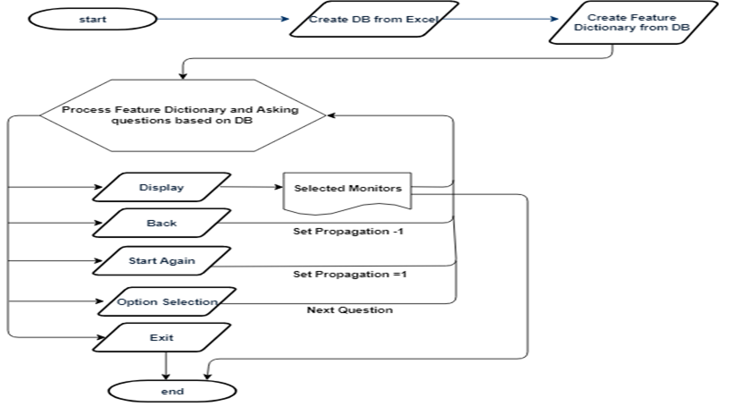
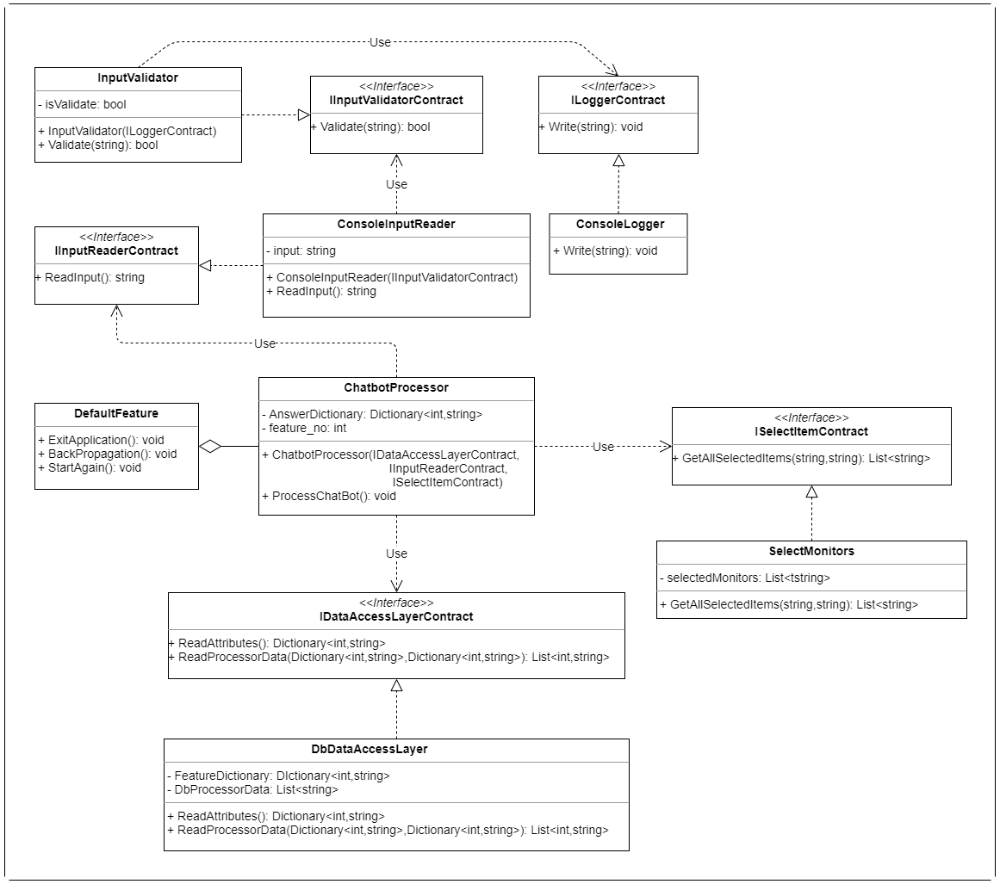
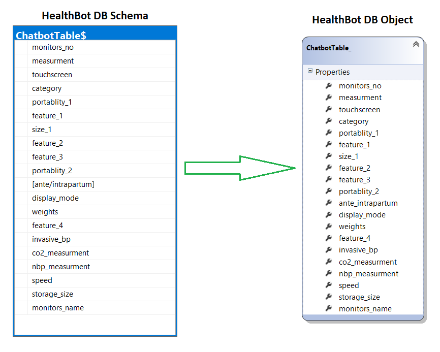

# Health Bot

**HealthBot** is a console based chatbot application which assists a **_clinical person_** to ease the purchase of available **_patient monitoring devices_** that are relevant to him.  
**_ChatBot_** asks a set of multiple-choice questions to clinical person and based on his choices, a small set of suitable patient monitors are suggested to him. Questions are formed based on various features of different patient monitors.

## Important Features of ChatBot

1. **Display Patient Monitors:** User can view a set of filtered patient monitors based on his previous choices at any stage during the conversation.
2. **Go Back:** User can go back to the previous question at any stage during the conversation.
3. **Start Again:** User can start the conversation from the beginning at any stage.
4. **Abort:** User can end the conversation at any stage.

A **patient monitor** is an electronic medical device that consists of one of more monitoring sensors, a processing component(s), and a screen display(also called a "monitor") that provide and record for medical professionals a patient's medical vital signs(body temperature, blood pressure, pulse rate and respiratory rate) or measurements of the activity of various body organs such as ECG monitors, anesthesia monitors, or EKG monitors.

## Flowchart

**Flowchart** for HealthBot application.

## UML Class Diagram

**UML class diagram** for HealthBot application.

## Database Model

**Database model** for HealthBot application.

